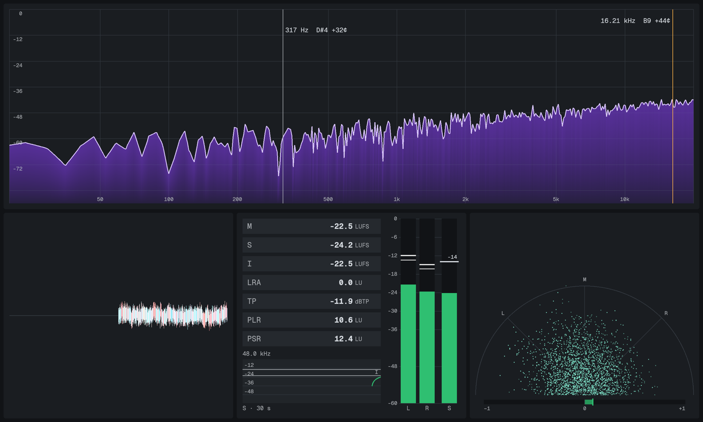
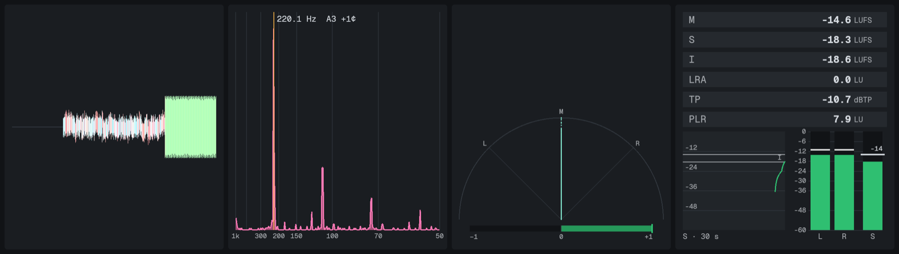

# Das-Meter

Live Meters for whatever your computer plays: a Waveform, a Spectrum, a
Loudness Meter, a Stereometer and a Cepstrum. They sit in a Bar at the edge of
your screen or in a window of their own. Das-Meter meters the system's output,
or single DAW tracks through its Send Plugin. It's free and open source, for
macOS and Linux, with Windows to come.



**[Download](https://github.com/daswerk/Das-Meter/releases/latest)** ·
**[Install guide](INSTALL.md)** ·
**[Docs](https://daswerk.github.io/Das-Meter/)**

## What it does

- **Waveform:** the audio over time, coloured by low, mid and high band.
- **Spectrum:** an FFT spectrum with a cursor readout, and a peak line that
  follows the loudest frequency and names its note.
- **Loudness Meter:** Momentary, Short-term and Integrated loudness, LRA, True
  Peak, PLR and PSR, a loudness graph and level bars. It measures to ITU-R
  BS.1770-5 and EBU Tech 3341/3342, checked against the EBU test set
  ([what that means](https://daswerk.github.io/Das-Meter/measurements.html)).
- **Stereometer:** a goniometer and a correlation bar.
- **Cepstrum:** the cepstrum of the signal, and the pitch it finds, with its
  frequency and note.



It also has:

- **Two layouts.** A **Bar** docks to an edge of the screen and can reserve that
  space. You can pull Meters out of it as Pop-outs. **Window mode** has
  resizable panes.
- **Two sources.** **System Capture** meters everything your computer plays.
  The **Send Plugin** (CLAP, VST3 and AU) sends single DAW tracks, including
  ones behind ASIO.
- **Themes and Presets.** Themes come as built-ins, an editor and TOML files.
  Presets save each Meter's settings and the layout, and you can share them as
  `.dasmeter-preset` files.
- **A low footprint.** Das-Meter draws only when something changes and sleeps
  in silence.

## Install

| | |
|---|---|
| **macOS** 14.6+, Apple silicon and Intel | Download `Das-Meter-<version>.dmg`, drag Das-Meter to Applications, then allow it once under **System Settings ▸ Privacy & Security ▸ Open Anyway**. |
| **Linux** x86_64 (Arch, Fedora, Ubuntu 24.04+…), PipeWire | Download `das-meter-<version>-linux-x86_64.tar.gz`, unpack it and run `./das-meter`. |
| **Windows** 10 and 11 | Coming soon. |

The [install guide](INSTALL.md) has every step, including the Send Plugin,
updates, uninstalling and building from source.

## Building from source

You need a recent stable [Rust](https://rustup.rs) (1.95 or newer). On Linux
you also need a few system libraries; see
[Building from source](INSTALL.md#building-from-source).

```sh
cargo run --release --bin das-meter   # run the app
cargo test --workspace                # run the tests
```

On macOS, `scripts/macos-bundle.sh` builds `Das-Meter.app`. System Capture only
works from the app bundle. To serve the docs site locally, run
`mdbook serve docs/site`.

| Path | What it is |
|---|---|
| `crates/transport` | The shared-memory table that carries audio from Send Plugins to the app |
| `crates/analysis` | Meter analysis: audio frames in, Meter readings out |
| `crates/core` | The headless app core: all app behaviour, driven by events |
| `crates/app` | The app: the platform shell and the Meter renderers |
| `crates/send-plugin` | The Send Plugin (CLAP, wrapped to VST3 and AU) |
| `docs/site` | The [docs site](https://daswerk.github.io/Das-Meter/) (mdBook) |
| `docs/adr` | Architecture decisions, with the [research](docs/research) behind them |
| `docs/release-checklist.md` | How to make a release |

## Licence

Dual-licensed under [MIT](LICENSE-MIT) or [Apache-2.0](LICENSE-APACHE), at your
option. Contributions are accepted under the same terms.
